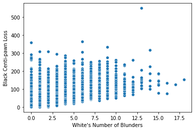

Example
-------------

This page goes over a simple usage of the library. We will analyse a `chess matches dataset <https://www.kaggle.com/datasets/ahmedalghafri/lichess-chess-games-statistics>`_
to determine the effect of blunders on centipawn loss.

Analysing the problem
"""""""""""""""""""""

First, some chess terminology:

 | **Blunders** are moves that are considered unforgivable errors
 | **Centipawn Loss** is a measure of how much of a disadvantage the play is in: 100 centipawn equals 1 pawn.
 | **Rating** is a measure of how skilled a player is, for matchmaking purposes.

The dataset contains data regarding white's and black's number of blunders, average centipawn loss and rating.
It also contains other features, but we will ignore them for simplicity sake.

Our task is to determine the effect of blunders on centipawn loss: in short, just how many pawns
you lose by making blunders.

.. code-block:: python

    import numpy as np
    import pandas as pd
    import seaborn as sns

    df = pd.read_csv('chess.csv')
    df = df.drop(["Unnamed: 0", "Game ID", "Opening Ply", "Opening ECO", "White's Number of Inaccuracies", "White's Number of Mistakes", "Black's Number of Inaccuracies", "Black's Number of Mistakes"], axis=1)

As a sanity check, we will first take a look at the relation between white's number of blunders
and black centipawn loss. Common sense makes would makes us think that the causal relationship there
would be small or negative, since white's mistakes should not impact black's ability to play the game.

Plotting these variables for visualization:

The plot reveals a surprising association: the more blunder's white makes, the worst black plays.

This very likely happens because matchmaking assures that bad players meet other bad players, and
good players meet good players. So if white is making a small amount of mistakes, odds are he is good
at the game and is facing opponents who also are.
This is an example of **common cause** bias, and it can be avoided by using a causal inference model
that controls for matchmaking in some way. To learn more about that, check out `causal graphs <https://towardsdatascience.com/use-causal-graphs-4e3af630cf64>`_.

In this case, we will control for white's and black's rating, as well as black's number of blunders.
This way, we will hopefully compare only players with similar skill. The model we are going
to use for that is the SLearner.

Applying the model
""""""""""""""""""

Now, to simplify the problem we will make our treatment data binary. This means we will only consider
two situations: you either make a lot of blunders, or you dont.

.. code-block:: python

    treatment_col = "White's Number of Blunders"
    treatment = (df[treatment_col] >= df[treatment_col].mean()).astype(int)

We then create our model. We are going to use the :mod:`pycausal_explorer.linear._linear_models`,
a meta learner, using sklearn's causal forests as the predictor.

.. code-block:: python

    from pycausal_explorer.meta import SingleLearnerRegressor
    from sklearn.ensemble import RandomForestRegressor

    learner = SingleLearnerRegressor(RandomForestRegressor())

We will then fit our model to the data, and predict the treatment effect

.. code-block:: python

    learner.fit(df[["Black Rating", "White Rating", "Black's Number of Blunders"]], df["Black Centi-pawn Loss"], treatment=treatment)
    resB = learner.predict_ite(df[["Black Rating", "White Rating", "Black's Number of Blunders"]])
    print("Effect of white's blunders on black's loss: ", resB.mean())

.. code-block:: console

    Effect of white's blunders on black's loss:  -1.4069125492747534

As expected, the effect is pretty small. It's also negative, which makes sense: If white
is playing poorly, black should find less opportunities to misplay.
So let's move on to the effect on *white's* centipawn loss

.. code-block:: python

    learner.fit(df[["Black Rating", "White Rating", "Black's Number of Blunders"]], df["White Centi-pawn Loss"], treatment=treatment)
    resB = learner.predict_ite(df[["Black Rating", "White Rating", "Black's Number of Blunders"]])
    print("Effect of white's blunders on whitw's loss: ", resB.mean())

.. code-block:: console

    Effect of white's blunders on white's loss:   41.63210605667355

We can see it's somewhat big, as it should be.

By now you should have an idea of how this library's work. If you want to decide which model to use,
check out out :doc:`guide`. If you want to know every model we have, we also have a :doc:`model_list`.
